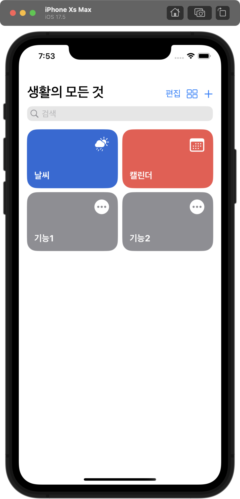
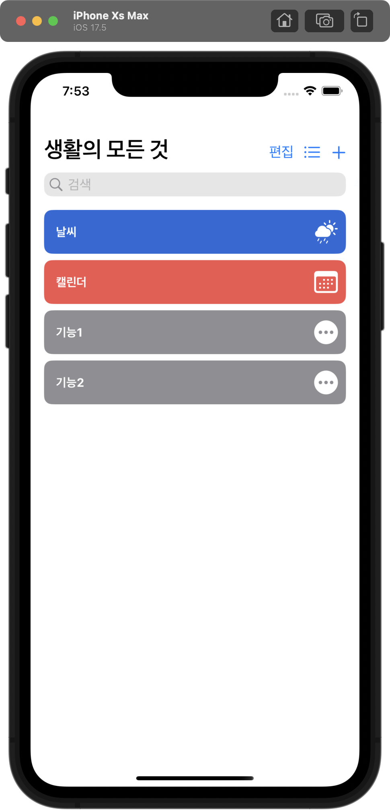

# SwiftUI_UniversalApp
SwiftUI로 다기능 앱 구현
## 프로젝트 소개
- 생활 속에 주로 쓰이는 날씨, 캘린더 등의 앱을 따로 구분하지 않고, 한 앱에 내장하여 사용하기 편하게 하기 위하여 개발

- **최소 iOS 버전**
    - iOS 15

## 앱 기본 화면
**그리드 모드** | **선형 모드** 
:--------------:|:--------------:
 |  
